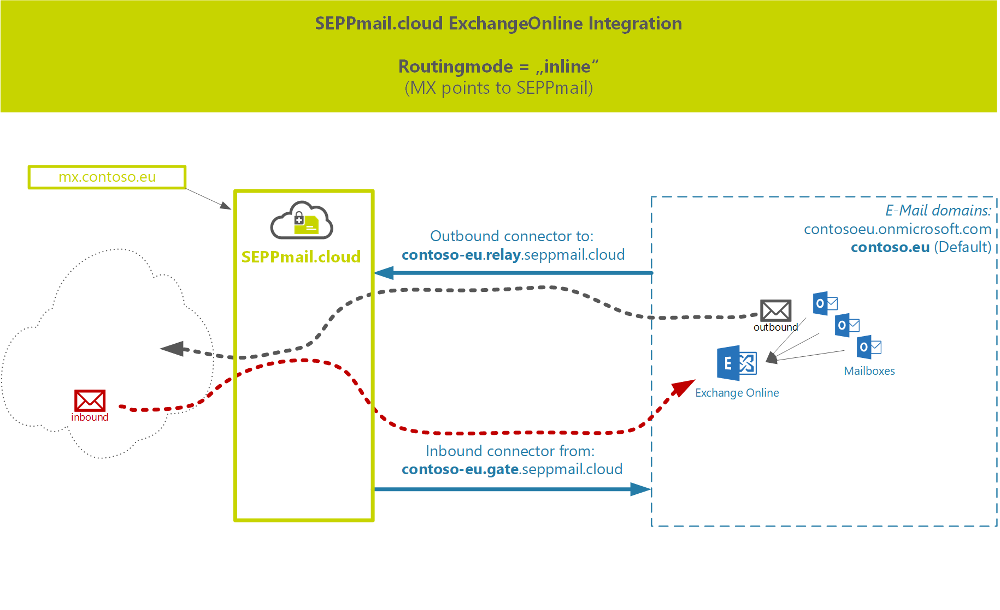
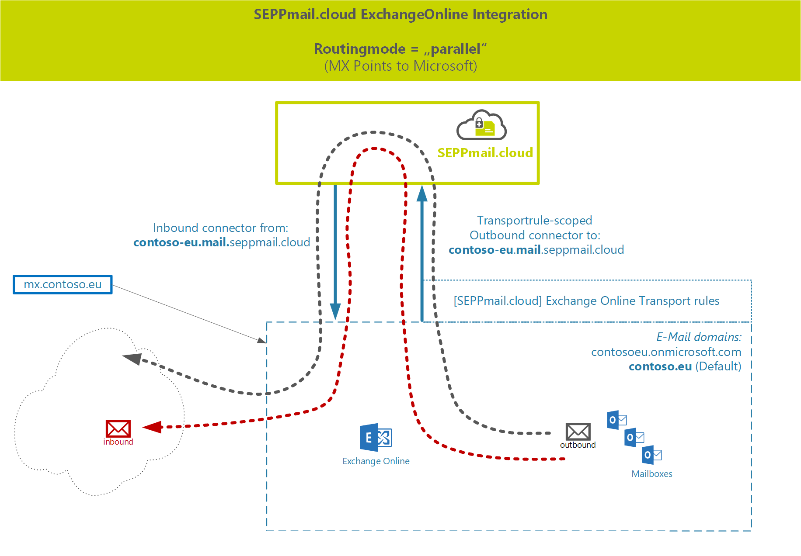

- [The SEPPmail365cloud PowerShell Module README.MD](#the-seppmail365cloud-powershell-module-readmemd)
  - [Introduction](#introduction)
  - [Latest Changes](#latest-changes)
  - [Prerequisites](#prerequisites)
  - [Security](#security)
  - [Module Installation](#module-installation)
    - [Installation on Windows](#installation-on-windows)
    - [Installation on macOS and Linux (experimental)](#installation-on-macos-and-linux-experimental)
  - [Routing modes](#routing-modes)
    - [Routing mode "inline"](#routing-mode-inline)
    - [Routing mode "parallel"](#routing-mode-parallel)
  - [Using the seppmail365cloud PowerShell module](#using-the-seppmail365cloud-powershell-module)
    - [Get to know your environment](#get-to-know-your-environment)
    - [Clean up before installing](#clean-up-before-installing)
  - [Setup the integration](#setup-the-integration)
    - [Example for routingmode: inline](#example-for-routingmode-inline)
    - [Example for routingmode: parallel](#example-for-routingmode-parallel)
  - [Review the changes](#review-the-changes)
  - [Test your mailflow](#test-your-mailflow)
  - [Advanced Setup](#advanced-setup)
    - [Creating Connectors and disabled Rules for time-controlled integration](#creating-connectors-and-disabled-rules-for-time-controlled-integration)
    - [Exclude e-Mail domains from the mailflow](#exclude-e-mail-domains-from-the-mailflow)
    - [Place TransportRules at the top of the rule-list](#place-transportrules-at-the-top-of-the-rule-list)

# The SEPPmail365cloud PowerShell Module README.MD

## Introduction

The SEPPmail365cloud PowerShell Core module is intended to integrate Exchange Online instances into the SEPPmail.cloud (SMC).
The module requires you to connect to your Exchange Online environment as administrator (or at least with Exchange Online administrative rights) via PowerShell and creates all necessary connectors and rules, based on the e-mail-routing type and region for you with a few commands.

## Latest Changes

Changes in the module versions are documented in 

## Prerequisites

The module requires *PowerShell Core*, mimimum version 7.2.1 and was tested on Windows and macOS. The module code wraps around the *ExchangeOnline* Powershell Commandlets, so the Exchange Online Module version 2.0.5 is a requirement as well.

>Note: Microsoft promotes to install the preview version of the ExchangeOnline PowerShell Module 2.0.6-preview5 or so. DO NOT INSTALL THE PREVIEW VERSION, as our module WILL NOT WORK.

__Use Version 2.0.5 of ExchangeOnlineManagement, and you will be fine.__

PowerShell Core on Linux should work as well, but has not been intensively tested so far.

>Note: *Windows PowerShell (5.1 and earlier versions) is not supported!* To run the module from Windows, install __PowerShell Core__ on your Windows machine, using the Microsoft Store or go to [Github](https://github.com/powershell/powershell) for other installation options.

## Security

When connecting to Exchange Online, we recommend using the -Device or -Credential based login option. If you want to use credential-based login, we recommend using the Microsoft "Secrets Management" module to store your username/passwords in a secure place on your disk.

## Module Installation

>IMPORTANT! Do not use the other PowerShell Module we have on the PowerShell Gallery "SEPPmail365". This module will create NON-WORKING setups as it is intended to be used with self-hosted, customer owned or MSP-operated SEPPmail Appliances.

### Installation on Windows

To install the SEPPmail365Cloud module, open Powershell Core (pwsh.exe) and execute:

```powershell
Install-Module "SEPPmail365cloud" -scope Currentuser
```

### Installation on macOS and Linux (experimental)

In addition to the main module you need to add PSWSMan which adds WSMan client libraries to Linux and macOS for remote connectivity to Exchange Online.

>Note: *Do this OUTSIDE Powershell in the appropriate shell (bash, or similar)!*

```bash
sudo pwsh -command 'Install-Module PSWSMan' #Read more on this here https://github.com/jborean93/omi
sudo pwsh -Command 'Install-WSMan'
```

__Further information__ on connecting to Exchange Online and bring the module up and running can be found on our GitHub repository for out other PowerShell Module [SEPPmail365 module documentation](https://github.com/seppmail/SEPPmail365#module-installation).

## Routing modes

When integrating your Exchange online environment with seppmail.cloud, you have to decide between two e-mail routing modes to Microsoft. We either set the mx-record to *SEPPmail.cloud* (inline) or leave it at *Microsoft* (parallel). Customers routing e-Mails via seppmail.cloud benefit from our outstanding e-mail filter which prevents spam and unwanted software flowing into your network via e-mail.

>Note: If you leave the mx-record at microsoft you CANNOT use the SEPPmail.cloud e-mail filter, but for sure our encryption processing possibilities.

Now lets look into the 2 different modes.

### Routing mode "inline"

Routing mode "inline" allows you to use the full power of the SEPPmail.cloud! In this scenario, the __mx-record of the e-mail domain is set to the SEPPmail cloud hosts__. Inbound e-mails flow to the SEPPmail.cloud, are scanned, treated cryptographically and then flow to Microsoft via connectors. Same is outbound, the mails simply pass the SEPPmail.cloud before leaving to the internet.



### Routing mode "parallel"

This routing mode is similar to the way you would integrate any SEPPmail Appliance (self hosted or MSP) with ExchangeOnline. E-mails flow to Microsoft, and are looped through SEPPmail.cloud, based on the need for cryptographic treatment. Unfortunately, no SEPPmail Virus or SPAM filter is possible in this configuration.



## Using the seppmail365cloud PowerShell module

### Get to know your environment

After the module setup is completed as described above and you have connected to your Exchange Online environment, create an environment report.

```powershell
New-SC365ExOReport -FilePath /Users/you/Desktop/ExoReport.html

# Even simpler with automatic creation of filename with timestamp
New-SC365ExOReport -FilePath ~/Desktop

# If you want to specify a literal path use:
New-SC365ExOReport -Literalpath c:\temp\myexoreport.html
```

The report will give you valued information about existing connectors, rules and other mailflow-related information. Keep this report stored for later investigation or questions.

### Clean up before installing

If your Exchange Online environment was originally integrated with a SEPPmail already, you need to backup, remove (or disable) the existing SEPPmail365 connectors and rules before integrating into seppmail.cloud.
To do this use our OTHER PS-Module **SEPPmail365**. Find info on [backup and removal SEPPmail connectors and rules here.](https://github.com/seppmail/SEPPmail365#cleanup-environment)

>Note: *If you do not remove existing __[SEPPmail]__ rules and connectors, the mailflow will be a mess and the integration will not work.*

## Setup the integration

After you are sure that your Exchange Online environment is prepared, you have received a **welcome e-mail** from SEPPmail, and followed all instructions, you can start with the integration.

You need to know 3 input values to run the CmdLets.

- **maildomain** (the e-mail domain of your Exchange Online environnement that has been configured in the seppmail.cloud. Most of the time this is the default-domain in your Exchange Online Tenant.)
- **routing** (either "inline" or "parallel", read above for details)
- **region** (the geographical region of the SEPPmail.cloud infrastructure)

You need to setup inbound and outbound-connectors and transport rules, so run the two commands as explained below.

### Example for routingmode: inline

```powershell
New-SC365Connectors -PrimaryMailDomain 'contoso.eu' -routing 'inline' -region 'ch'

# Currently no rules are needed for routingtype SEPPmail, so you are done after setting up the connectors!
```

### Example for routingmode: parallel

```powershell
New-SC365Connectors -PrimaryMailDomain 'contoso.eu' -routing 'parallel' -region 'ch'

# Important: Rules can only be created if the connectors are enabled. They are enabled by default, so if you use the example above it will work.
New-SC365Rules
```

## Review the changes

```Get-Inboundconnector``` and ```Get-OutboundConnector``` will show the installed connectors, and ```Get-Transportrule``` CmdLet will give you all information about transport rules.

## Test your mailflow

Send an e-mail from inside-out and outside-in to see if the mailflow is working.

## Advanced Setup

The module allows some extra-tweaks for advanced configurations

### Creating Connectors and disabled Rules for time-controlled integration

For sensitive environments, where mailflow may only be changed in specific time frames, it is possible to create rules and connectors "disabled". Both CmdLets New-SC365Connectors and New-SC365Rules have a -disabled switch. See examples below:

```powershell
New-SC365Connectors -PrimaryMailDomain 'contoso.eu' -routing 'parallel' -region 'ch'
New-SC365Rules -disabled
```

To enable the disabled transport rules in ExchangeOnline so that e-mails can flow through the SEPPmail.cloud, use the Exchange Online admin-website or the PowerShell Commands Enable/Disable-TransportRule.

```powershell

# Enable SEPPmail.cloud TransportRules
Get-TransportRule -Identity '[SEPPmail.cloud]*'|Enable-TransportRule

# Disable SEPPmail.cloud TransportRules
Get-TransportRule -Identity '[SEPPmail.cloud]*'|Disable-TransportRule

```

### Exclude e-Mail domains from the mailflow

By default, out transport rules allow e-mails from any accepted domain of the ExchangeOnline tenant to be sent through SEPPmail.cloud. If you want to limit the e-mail domains by excluding them use the -ExcludeEmailDomain parameter.

```powershell
New-SC365Rules -ExcludeEmailDomain 'contoso.onmicrosoft.com','contosotest.ch'
```

### Place TransportRules at the top of the rule-list

By default out transport rules will be placed at the bottom of all other transport rules. If you want to change this use:

```powershell
New-SC365Rules -PlacementPriority Top
```

<p style="text-align: center;">--- End of document ---</p>
