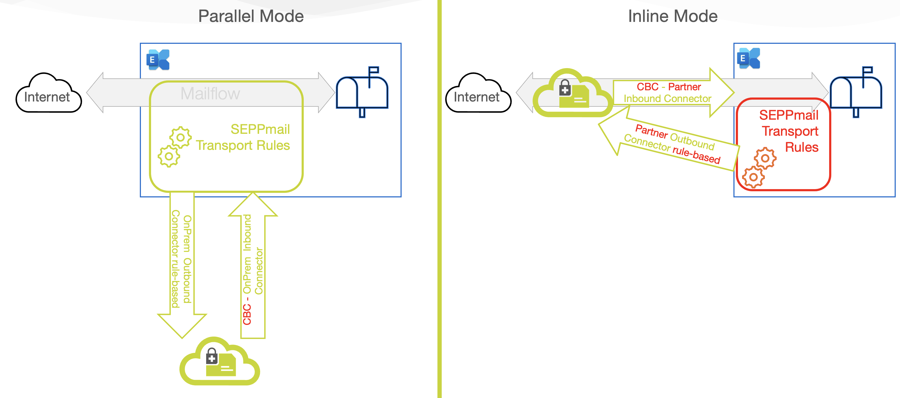

## Latest Changes

Changes in the module versions are documented in the 

***Setup SEPPmail.cloud in 3 easy steps:***

| 1-Install PowerShell CORE | 2-Install module | [3-Run the Setup Command](#setup-the-integration-for-basic-environments) |
| --------------- | --------------- | --------------- |
| [Microsoft PS-Core install docs](https://learn.microsoft.com/de-de/powershell/scripting/install/installing-powershell?view=powershell-7.3) | ```Install-Module seppmail365cloud``` | ```New-SC365Setup -force``` |

## NEW customers: Basic setup for most (single maildomain) environments

If you are a new customer and just got the deployment e-Mail from SEPPmail.cloud all you have to do is to run:

```powershell
New-SC365Setup
```

This will setup all necessary connectors and rules for your Microsoft tenant.

## EXISTING customers: Basic setup-update for most (single maildomain) environments

If you are an existing customer and just and just updated the PowerShell Module, do is to to update:

```powershell
New-SC365Setup -force
```

This will recreate all necessary connectors and rules for your Microsoft tenant.

## Check you Setup

If you want to know what setup has been implemented in your tenant, run Get-SC365Setup

```powershell
Get-SC365Setup
```

This will list connectors and transport rules of your tenant.

## Remove SEPPmail.cloud integration

To remove all SEPPmail.cloud connectors and rules, run:

```powershell
Remove-SC365Setup
```
- [The SEPPmail365cloud PowerShell Module README.MD](#the-seppmail365cloud-powershell-module-readmemd)
  - [Introduction](#introduction)
  - [Prerequisites](#prerequisites)
  - [Operating Systems](#operating-systems)
  - [Security](#security)
  - [Module Installation](#module-installation)
    - [Installation of the Module](#installation-of-the-module)
    - [Additional steps on macOS and Linux (experimental)](#additional-steps-on-macos-and-linux-experimental)
  - [Things to know before you start changing your E-Mail-routing](#things-to-know-before-you-start-changing-your-e-mail-routing)
    - [Routing modes](#routing-modes)
      - [Routing mode "inline"](#routing-mode-inline)
      - [Routing mode "parallel"](#routing-mode-parallel)
    - [Cloud Regions](#cloud-regions)
  - [Using the SEPPmail365cloud PowerShell module](#using-the-seppmail365cloud-powershell-module)
    - [Get to know your Microsoft Exchange Online environment](#get-to-know-your-microsoft-exchange-online-environment)
    - [Clean up before installing](#clean-up-before-installing)
  - [Setup the integration for BASIC environments](#setup-the-integration-for-basic-environments)
  - [Setup the integration for ADVANCED environments](#setup-the-integration-for-advanced-environments)
    - [Example for routingmode: inline](#example-for-routingmode-inline)
    - [Example for routingmode: inline/inboundonly](#example-for-routingmode-inlineinboundonly)
    - [Example for routingmode: parallel](#example-for-routingmode-parallel)
    - [Example for routingmode: parallel and multiple domains](#example-for-routingmode-parallel-and-multiple-domains)
    - [Example for routingmode: parallel and ALL E-Mail traffic via SEPPmail.cloud](#example-for-routingmode-parallel-and-all-e-mail-traffic-via-seppmailcloud)
  - [Review the changes](#review-the-changes)
  - [Test your mailflow](#test-your-mailflow)
  - [Advanced Setup Options](#advanced-setup-options)
    - [Creating Connectors and disabled rules for time-controlled integration](#creating-connectors-and-disabled-rules-for-time-controlled-integration)
    - [Place TransportRules at the top of the rule-list](#place-transportrules-at-the-top-of-the-rule-list)
    - [Tag E-Mails with an \[EXTERNAL\] marker in parallel mode](#tag-e-mails-with-an-external-marker-in-parallel-mode)
  - [Issues and solutions](#issues-and-solutions)
    - [Computer has User home directory on a fileshare (execution policy error)](#computer-has-user-home-directory-on-a-fileshare-execution-policy-error)
    - [Special Case : Connectors with "/" or "\\" in the name](#special-case--connectors-with--or--in-the-name)
    - [Special Cases - Still mail-loops after re-setup with Version 1.3.0+](#special-cases---still-mail-loops-after-re-setup-with-version-130)
    - [Well-Known Error: New-SC365Rules asks for rule names](#well-known-error-new-sc365rules-asks-for-rule-names)
    - [Testing ARC-Sealing (fail with reason 47)](#testing-arc-sealing-fail-with-reason-47)
      - [Powershell command to check that we are added to the trusted domains](#powershell-command-to-check-that-we-are-added-to-the-trusted-domains)
      - [Where to check with a test mail that everything went fine](#where-to-check-with-a-test-mail-that-everything-went-fine)

# The SEPPmail365cloud PowerShell Module README.MD

## Introduction

The SEPPmail365cloud PowerShell module has been built to simplify the integration Exchange Online (ExO) instances into the SEPPmail.cloud (SMC).
The module requires you to connect to your ExO environment as administrator (or at least with Exchange administrative rights) via PowerShell Core and creates all necessary connectors and rules, based on the e-mail-routing type and region for you with a few commands.

## Prerequisites

>Note: *Windows PowerShell (5.1 and earlier versions) is not supported!* To run the module from Windows, install __PowerShell Core__ on your Windows machine, using the Microsoft Store or go to [Github](https://github.com/powershell/powershell) for other installation options.

The module requires:

- *PowerShell Core* (minimum version 7.2.1)

The module requires and automatically installs:

- Exchange Online Module version minimum 3.0.0+
- DNSClient-PS 1.0+

If you want to know how to connect to Exchange Online via Powershell read [Exchange Online PS Module docs](https://learn.microsoft.com/de-de/powershell/exchange/connect-to-exchange-online-powershell?view=exchange-ps).

## Operating Systems

The code and was tested on **Windows** and **macOS**. PowerShell Core on _Linux_ should work as well, but has not been intensively tested so far.

## Security

When connecting to Exchange Online, we recommend using the **-Device** or **-Credential** based login option. If you want to use credential-based login, we recommend using the Microsoft **Secrets Management** module to store your username/passwords in a secure place on your disk.

## Module Installation

>IMPORTANT! **Do not use the PowerShell Module SEPPmail365 (without _cloud_ at the end)** we have also on the PowerShell Gallery. This module will create NON-WORKING setups as it is intended to be used with self-hosted, customer owned or MSP-operated SEPPmail **Appliances**.

### Installation of the Module

To install the SEPPmail365Cloud module, open Powershell Core (pwsh.exe) and execute:

```powershell
cd ~                              # moves into the Home-Directory

Install-Module "SEPPmail365cloud" # installs the SEPPmail365cloud module
```

### Additional steps on macOS and Linux (experimental)

In addition to the main module you need to add PSWSMan which adds WSMan client libraries to Linux and macOS for remote connectivity to Exchange Online.

>Note: *Do this OUTSIDE Powershell in the appropriate shell (bash, or similar)!*

```bash
sudo pwsh -command 'Install-Module PSWSMan' #Read more on this here https://github.com/jborean93/omi
sudo pwsh -Command 'Install-WSMan'
```

__Further information__ and detailed steps for the module setup can be found on our GitHub repository for out other PowerShell Module [SEPPmail365 module documentation](https://github.com/seppmail/SEPPmail365#module-installation).

## Things to know before you start changing your E-Mail-routing

### Routing modes

When integrating your Exchange online environment with SEPPmail.cloud, you have to decide between two e-mail routing modes to Microsoft. We either set the mx-record to *SEPPmail.cloud* (inline) or leave it at *Microsoft* (parallel). Customers routing e-Mails via SEPPmail.cloud benefit from our outstanding e-mail filter which prevents spam and unwanted software flowing into your network via e-mail.

>Note: If you leave the mx-record at microsoft you CANNOT use the SEPPmail.cloud e-mail filter, but for sure our encryption processing possibilities.

Now lets look into the 2 different modes.



#### Routing mode "inline"

Routing mode "inline" allows you to use the full power of the SEPPmail.cloud! In this scenario, the **mx-record of the e-mail domain is set to the SEPPmail cloud hosts**. Inbound e-mails flow to the SEPPmail.cloud, are scanned, treated cryptographically and then flow to Microsoft via connectors. Same is outbound, the mails simply pass the SEPPmail.cloud before leaving to the internet.

#### Routing mode "parallel"

This routing mode is similar to the way you would integrate any SEPPmail Appliance (self hosted or MSP) with ExO. E-mails flow to Microsoft, and are looped through SEPPmail.cloud, based on the need for cryptographic treatment. Unfortunately, no SEPPmail Virus or SPAM filter is possible in this configuration.

### Cloud Regions

SEPPmail.cloud is operated in different cloud-regions (datacenters). Based on what you ordered, your tenant may be provisioned in one or the other cloud-region.

Deploying to the wrong region will lead to a non-working environment. Your onboarding E-Mail should contain all information for your region.

## Using the SEPPmail365cloud PowerShell module

### Get to know your Microsoft Exchange Online environment

After the module setup is completed as described above and you have connected to your Exchange Online environment, create an environment report.

```powershell
# The easiest way is to run the command without any parameter
New-SC365ExOReport # Will generate a report with an autogenerated name in the current folder. Search for *.HTML files.

# Also simpler with automatic creation of filename with timestamp
New-SC365ExOReport -FilePath ~/Desktop

# Find out more options with integrated HELP
Get-Help New-SC365ExOReport
```

The report will give you valued information about existing connectors, rules and other mailflow-related information. Keep this report stored for later investigation by support or as a documentation of the current state.

### Clean up before installing

If your ExO environment was originally integrated with a SEPPmail-Appliance, you need to **remove the existing SEPPmail365 connectors and rules** before integrating into SEPPmail.cloud.

To do this, use our OTHER PS-Module **SEPPmail365** or the Office admin Portal. Find info on [Remove SEPPmail connectors and rules here.](https://github.com/seppmail/SEPPmail365#cleanup-environment)

>Note: *If you do not remove existing __[SEPPmail]__ rules and connectors, the mailflow will be a **mess** and the **integration will not work**.*


## Setup the integration for BASIC environments

A basic environment has the following characteristics.

- All customer mailboxes are hosted in Exchange Online.
- The customer uses **one** e-mail domain for all users.
- This one e-mail domain is the tenant-default domain.
- This e-mail has been used to book SEPPmail.cloud.
- There are no hybrid connectors.
- There are no other external connectors.
- There are no cross-tenant connectors.
- There are no other 3rd party connectors.
- There are no transport-rules implemented which may affect mailrouting to SEPPmail.cloud

If all those requirements are met the 3 commandlets below are your friends and will do the setup job for you.

- Get-SC365Setup ==> Read the existing setup
- New-SC365Setup ==> create a new setup
- Remove-SC365Setup ==> remove an existing setup

## Setup the integration for ADVANCED environments

Advanced Setups require a deeper understanding of the impact of the SEPPmail.cloud integration and allow more flexibility.

After you have received a **welcome e-mail** from SEPPmail, and followed all instructions in the e-mail, you can start with the integration.

You need to know 3 input values to run the CmdLets.

- **SEPPMailCloudDomain** (the e-mail domain of your Exchange Online environnement that has been configured in the SEPPmail.cloud. Most of the time this is the default-domain in your Exchange Online Tenant.)
- **routing** (either "inline" or "parallel", read above for details)
- **region** ("de" or "ch", the geographical region of the SEPPmail.cloud infrastructure)
- **inBoundOnly** (a parameter you may set or not set in INLINE Mode only, which is for customers which use our INBOUND filter only)

>Note: All 4 parameters are automatically populating valid options if you press TAB after the parameter. This reduces typo errors.

You need to setup inbound and outbound-connectors and transport rules, so run the two commands as explained below.

### Example for routingmode: inline

```powershell
New-SC365Connectors -SEPPmailCloudDomain 'contoso.ch' -routing 'inline' -region 'ch'
New-SC365Rules -routing 'inline' -SEPPmailCloudDomain 'contoso.ch'
```

### Example for routingmode: inline/inboundonly

```powershell
New-SC365Connectors -SEPPmailCloudDomain 'contoso.eu' -routing 'inline' -region 'ch' -inboundonly
New-SC365Rules -routing 'inline' -SEPPmailCloudDomain 'contoso.eu'
```

### Example for routingmode: parallel

```powershell
New-SC365Connectors -SEPPmailCloudDomain 'contoso.eu' -routing 'parallel' -region 'de'

# Important: Rules can only be created if the connectors are enabled. They are enabled by default. If you use the example below, integration with SEPPmail.cloud will immediately work.
New-SC365Rules -routing parallel -SEPPmailCloudDomain 'contoso.eu'
```

### Example for routingmode: parallel and multiple domains

If you have configured multiple domains in your M365 tenant, you may want to use one, some or all of them for seppmail.cloud. Below find a setup for multi-domains.

```powershell
# Use the tenant-default-domain here !
New-SC365Connectors -SEPPmailCloudDomain 'fabrikam.eu' -routing 'parallel' -region 'de'

# Important: Rules can only be created if the connectors are enabled. They are enabled by default. If you use the example below, integration with SEPPmail.cloud will immediately work.
New-SC365Rules -SEPPmailCloudDomain 'fabrikam.eu','fabrikam.de','fabrikam.ch','fabrikam.at' -routing 'parallel' 
```

### Example for routingmode: parallel and ALL E-Mail traffic via SEPPmail.cloud

By default parallel mode routes only E-Mails which require cryptographic processing via SEPPmail cloud. You can change this with the 

```powershell
New-SC365Connectors -SEPPmailCloudDomain 'fabrikam.eu' -routing 'parallel' -region 'de'

# Important: Rules can only be created if the connectors are enabled. They are enabled by default. If you use the example below, integration with SEPPmail.cloud will immediately work.

# Sets the transport rules up, and routes ALL inbound traffic to SEPPmail.cloud
New-SC365Rules -SEPPmailCloudDomain 'fabrikam.eu' -routing 'parallel' -CryptoContentOnly:$false
```

## Review the changes

```powershell
Get-SC365Connectors -routing parallel
Get-SC365Rules -routing parallel

# Important: Those 2 commands will show the current connectors and rules.
```

You can use also the native Exchange Online Commandlets.

```Get-Inboundconnector``` and ```Get-OutboundConnector``` will show the installed connectors, and ```Get-Transportrule``` CmdLet will give you all information about transport rules.

## Test your mailflow

Send an e-mail from inside-out and outside-in to see if the mailflow is working. If mailtransport fails, consult the logging information in the SMC-Portal and the message-trace in ExO for troubleshooting.

## Advanced Setup Options

The module allows some extra-tweaks for advanced configurations.

### Creating Connectors and disabled rules for time-controlled integration

For sensitive environments, where mailflow may only be changed in specific time frames, it is possible to create rules and connectors "disabled". Both CmdLets New-SC365Connectors and New-SC365Rules have a -disabled switch. See examples below:

```powershell
New-SC365Connectors -SEPPmailCloudDomain 'contoso.eu' -routing 'parallel' -region 'de' -disabled
New-SC365Rules -SEPPmailCloudDomain 'contoso.eu' -disabled
```

To enable the disabled transport rules in ExO so that e-mails can flow through the SEPPmail.cloud, use the Exchange Online admin-website or the PowerShell Commands Enable/Disable-TransportRule.

```powershell

# Enable SEPPmail.cloud TransportRules
Get-TransportRule -Identity '[SEPPmail.cloud]*'|Enable-TransportRule

# Disable SEPPmail.cloud TransportRules
Get-TransportRule -Identity '[SEPPmail.cloud]*'|Disable-TransportRule

# To avoid getting asked for every rule to confirm the change and run the command in "silent" mode use
Get-TransportRule -Identity '[SEPPmail.cloud]*'|Disable-TransportRule -Confirm:$false -Verbose
```

### Place TransportRules at the top of the rule-list

By default out transport rules will be placed at the bottom of all other transport rules. If you want to change this use:

```powershell
New-SC365Rules -SEPPmailCloudDomain 'contoso.eu ' -PlacementPriority Top
```

### Tag E-Mails with an [EXTERNAL] marker in parallel mode

Customers which use the SMC inline, can configure the SMC to tag all e-mails inbound as [EXTERNAL] (or similar). This is not possible in parallel mode.

If you use prepend disclaimer on your inbound traffic, Microsoft will break the structure of the encrypted mail and our cloud will not be able to decrypt the mail anymore.

By activating the "Stop processing more rules" option on the transport rule [SEPPmail.cloud] - 100 Route incoming e-mails to SEPPmail, you make sure that the disclaimer is only added after the decryption. Unfortunately, this will still break the S/MIME or PGP signatures. This is why we recommend to only change the subject of the e-mail.

If you use parallel routing and want to mark e-mails coming from outside your organization, please use a transport rule to prepend the subject with [EXTERNAL] and/or use the special tag from Microsoft according to the following example:

```powershell
Set-ExternalInOutlook -Enabled $true
```

## Issues and solutions

### Computer has User home directory on a fileshare (execution policy error)

If your computer has the users directory on a fileshare, Powershell still installs the Module in the $currentuser scope in your homedirectory. This sill raise issues with execution policy settings. To avoid this you can.

1.) Start PowerShell with no execution policy, by opening a terminal (cmd.exe) and run pwsh -executionpolicy unrestricted.

2.) Install the module to a local drive by:

```powershell
Save-module seppmail365cloud -Path c:\temp
import-modue c:\temp\seppmail365cloud
```

### Special Case : Connectors with "/" or "\\" in the name

We had a version of the SEPPmail.cloud connectors in place which used slashes in the name. Microsoft somehow stopped to accept this. If you find such a connector do this:

1. Rename connectors in the admin.microsoft.com portal
2. Delete them after renaming in the admin portal.

### Special Cases - Still mail-loops after re-setup with Version 1.3.0+

If you set up everything according to the description above, and still have mail-loops, check if the recipient is also in the SEPPmail.cloud, the recipient tenant MUST also use the newest connectors (CBC). Reach out to he recipients admin and force them to update their setup.

### Well-Known Error: New-SC365Rules asks for rule names

We saw this on several windows machines, but could not trace it down so far. If you get this error send us an e-Mail to support.

### Testing ARC-Sealing (fail with reason 47)

In a parallel setup, a working ARC-Sealing mechanism is imperative for a working mailflow. Use the below steps and guidance to check if your ARC-Sealing works.

#### Powershell command to check that we are added to the trusted domains

```powershell
Get-ArcConfig
```

#### Where to check with a test mail that everything went fine

Make sure to find a header with ARC-Message-Signature which starts with i=X, *.seppmail.cloud; spf=...
This headers tells if SPF and DKIM were good when the mail arrived to us. To make sure Microsoft interpreted it correctly, with the first Authentication-Results from the top of the headers. Here, a failed spf or dkim is no problem as long as it ends up with either compauth=pass reason=100 (SPF and DKIM good, regardless of ARC) or compauth=pass reason=130 (SPF and/or DKIM failed, but a trusted ARC tells us everything is fine).

More info can be found in the [Microsoft documentation on ARC Sealing](https://learn.microsoft.com/en-us/microsoft-365/security/office-365-security/use-arc-exceptions-to-mark-trusted-arc-senders?view=o365-worldwide)

To understand the compauth reason numbers see [Microsoft documentation on authentication result header fields](https://learn.microsoft.com/en-us/microsoft-365/security/office-365-security/message-headers-eop-mdo?view=o365-worldwide#authentication-results-message-header-fields)

<p style="text-align: center;">--- End of document ---</p>
