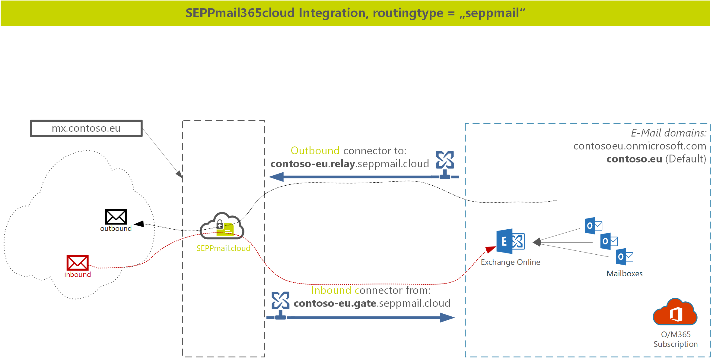
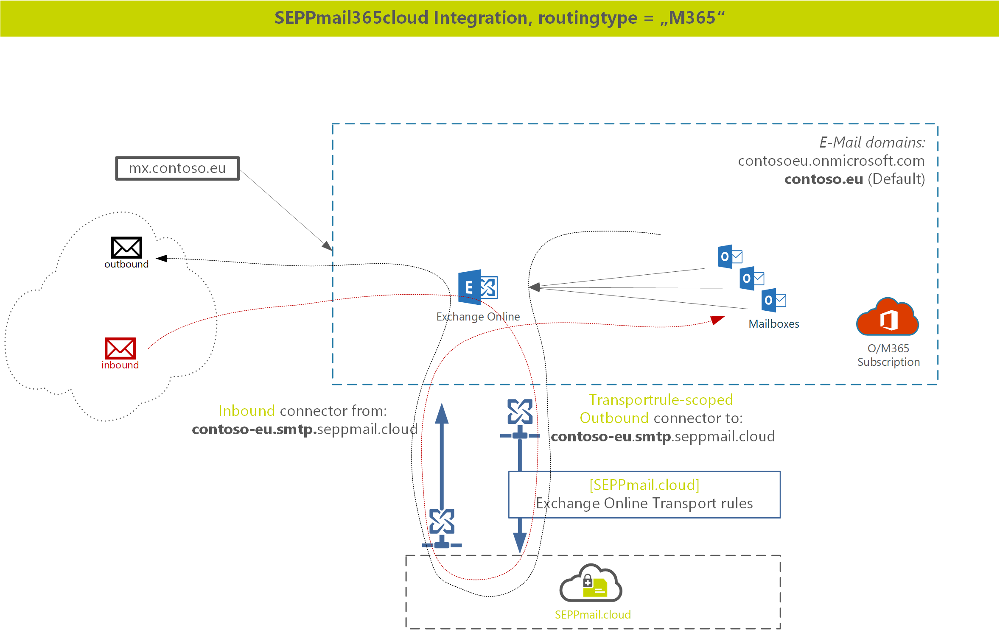

# The seppmail365cloud PowerShell Module README.MD

## Introduction

The SEPPmail365cloud PowerShell module is a multi-platform PowerShell module, intended to integrate Exchange Online into the seppmail.cloud.
The module requires you to connect to your Exchange Online environment and creates all necessary connectors and rules, based on the mail-routing type and region.

## Prerequisites

The module requires *PowerShell Core*, mimimum version 7.2.1 and was tested on Windows and macOS. The module code wraps around the *ExchangeOnline* Powershell Commandlets, so the Exchange Online Module minimum version 2.0.5 is a requirment as well.

PowerShell Core on Linux should work as well, but has not been intensively tested so far.

Windows PowerShell is not supported. Do install PowerShell Core on your Windows machine, use the Microsoft Store on your Client or go to [Github](https://github.com/powershell/powershell) for installation details on other platforms.

## Security

When connecting to Exchange Online, we highly recommend using the -Device Login. If you want to use credential-based login, use Microsoft Secretmanagement module to store your username/passwords in a secure place.

## Module Installation

### Installation on Windows

To install the module, Open Powershell Core (pwsh.exe) and execute:

```powershell
Install-Module "SEPPmail365" -scope Currentuser
```

### Installation on macOS and Linux

In addition to the main module you need to add PSWSMan which adds WSMan client libraries to linux and macOS for remote connectivity to Exchange Online.

*Do this OUTSIDE Powershell in the shell (bash, or similar)!*

```shell
sudo pwsh -command 'Install-Module PSWSMan' #Read more on this here https://github.com/jborean93/omi
sudo pwsh -Command 'Install-WSMan'
```

Furthe information on connecting to Exchange Online and make the module work can be found in our [SEPPmail365 module documentation](https://github.com/seppmail/SEPPmail365#module-installation).

## Routing modes

seppmail.cloud supports two e-Mail routing modes to M365. We either set the mx-record to *seppmail.cloud* or leave it at *Microsoft*. Customers routing e-Mails via seppmail.cloud benefit from our great e-Mail filter which prevents spam and unwanted software flowing in your network via e-mail.

Now lets look into the 2 different modes

### Routing mode "seppmail*

In this case, inbound e-Mails flow to the seppmail.cloud, are treated there and then flow to M365 via connectors. Same is outbound, the mails simply pass the seppmail.cloud before leaving to the internet.



### Routing mode "M365"

This routing mode is similar to the way you would integrate any SEPPmail Appliance (self hosted or MSP). E-mails flow to Microsoft, and are looped through SEPPmail based on the need for cryptographic treatment.




# Using the seppmail365cloud module

## Get to know your environment

After module setup is completed and you have connected to your Exchange Online environment create an environmen report.

```powershell
New-SM365ExOReport -FilePath /Users/you/Desktop/Exoreport.html
```

The report will give you valued information about existig connectors, rules and other mailflow-related information. Keep this report stored for later investigatoion or questions.

## Cleaning up

If your M365 environment was integrated with a SEPPmail already you need to backup and remove the SEPPmail365 connectors and rules before integratig into seppmail.cloud. Find info on [backup and removal SEPPmail connectors and rules here.](https://github.com/seppmail/SEPPmail365#cleanup-environment)

Note: *If you dont remove existing \[SEPPmail\] rules and connectors, mailflow will be a mess and the integration will not work.*

## Setup the integration


### Routingtype: seppmail

```powershell
New-SC365Connectors -maildomain 'contoso.eu' -routing seppmail -region 'ch'
```


### Routingtype: M365

```powershell
New-SC365Connectors -maildomain 'contoso.eu' -routing sM365 -region 'ch'

New-SC365Rules
```


## Offene Fragen

- routingtype M365 oder microsoft oder Exo oder Exchangenline
- New-SC365Connectors ==> Remove alle [SEPPmail.cloud] connectors ? oder nur den einen
- Name der Connectors OK ? (Region einfügen ?)
- Connector Settings

- TransportRules: Bei parameter -routing 'seppmail' einfach Info ausgeben ?


